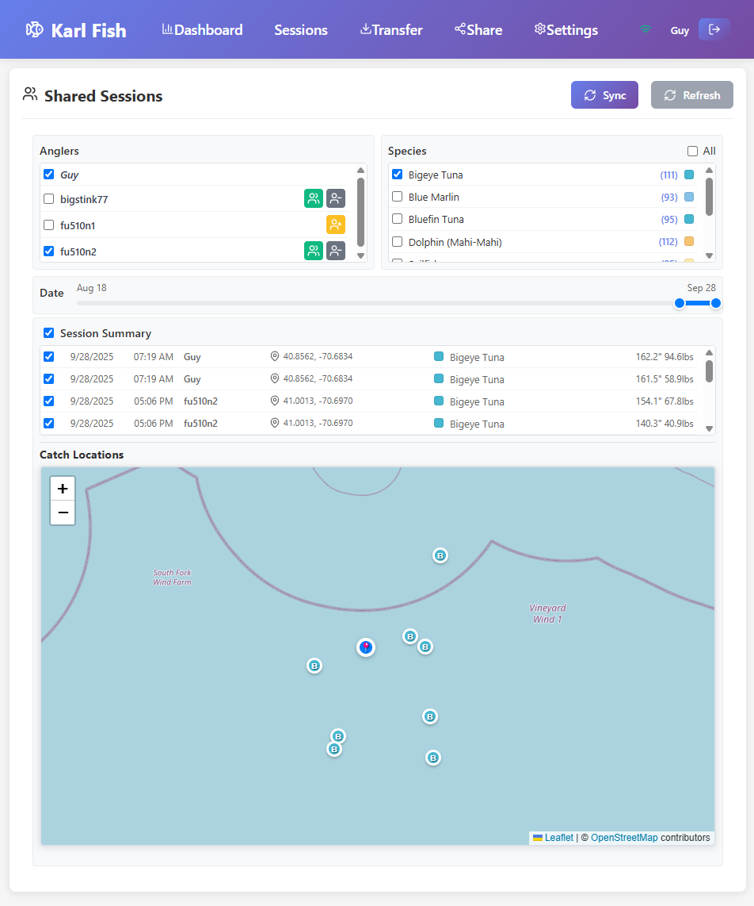

# Karl Fish - Fishing Log Application




A comprehensive React-based fishing log application that can be deployed as a web app or desktop/tablet application using Tauri. Features integration with NMEA 2000 marine electronics networks for automatic data collection from all connected devices.

## Features

### 🎣 Core Functionality
- **Fishing Session Logging**: Record date, time, location, and environmental conditions
- **Fish Catch Tracking**: Log species, length, weight, condition, bait, and notes
- **Environmental Data**: Track weather conditions, water temperature, depth, and clarity
- **Location Services**: GPS integration for accurate position logging
- **Offline Maps**: Download map tiles for offline use with leaflet.offline plugin

### 📡 NMEA 2000 Integration
- **NMEA 2000 Network Support**: Automatic data collection from all connected marine electronics via N2K gateway
- **Real-time Data**: Live updates of position, depth, water temperature, weather, and engine data
- **Supported NMEA 2000 PGNs**:
  - PGN 129025 - Position, Rapid Update (GPS coordinates)
  - PGN 130306 - Wind Data (speed, direction)
  - PGN 128267 - Water Depth
  - PGN 127250 - Vessel Heading
  - PGN 127488 - Engine Parameters
  - PGN 130310 - Environmental Parameters (temperature, pressure)
  - PGN 127258 - Engine RPM
  - PGN 127505 - Fluid Level (fuel, water, etc.)

### 💾 Data Management
- **Local Storage**: IndexedDB for offline data storage with user-specific data isolation
- **Data Export**: CSV and JSON export options
- **Email Integration**: Send fishing logs via email
- **Statistics**: Comprehensive fishing statistics and reports
- **Search & Filter**: Find sessions by species, location, or notes
- **Cloud Sync**: Supabase integration for data synchronization and sharing

### 👥 Social Features
- **User Authentication**: Secure user accounts with email verification
- **Friend System**: Add friends and manage friend requests with comprehensive state management
- **Session Sharing**: Share fishing sessions with friends or make them public
- **Privacy Controls**: Control who can see your sessions (private, friends, public)
- **Angler Discovery**: Find and connect with other anglers
- **Interactive Sharing Dashboard**: Filter sessions by users and species with color-coded visualization
- **Live Map Integration**: Interactive Leaflet maps showing catch locations with clustering
- **Real-time Updates**: Live updates when friends share new sessions

### 🖥️ Deployment Options
- **Web Application**: Run in any modern browser
- **Desktop App**: Native desktop application using Tauri
- **Cross-platform**: Windows, macOS, and Linux support
- **Cloud Deployment**: Deploy to Vercel or GitHub Pages
- **Custom Domains**: Support for custom domain configuration

## Installation

### Prerequisites
- Node.js 16+ 
- Rust (for Tauri desktop builds)
- Git
- Supabase account (for cloud features)

### Web Application
```bash
# Clone the repository
git clone <repository-url>
cd karl-fish

# Install dependencies
npm install

# Set up environment variables
cp .env.example .env.local
# Edit .env.local with your Supabase credentials

# Start development server
npm run dev

# Build for production
npm run build

# Build for specific platforms
npm run build:vercel    # For Vercel deployment
npm run build:github    # For GitHub Pages deployment
```

### Desktop Application (Tauri)
```bash
# Install Tauri CLI
npm install -g @tauri-apps/cli

# Run in development mode
npm run tauri:dev

# Build desktop application
npm run tauri:build
```

## Environment Setup

### Supabase Configuration
1. Create a new project at [supabase.com](https://supabase.com)
2. Go to Settings → API to get your project URL and anon key
3. Create a `.env.local` file in the project root:
```bash
VITE_SUPABASE_URL=your_supabase_project_url
VITE_SUPABASE_ANON_KEY=your_supabase_anon_key
```
4. Run the database schema setup:
   - Go to your Supabase project dashboard
   - Navigate to SQL Editor
   - Copy and paste the contents of `db/supabase-schema.sql`
   - Execute the script to set up tables, functions, and policies

### Deployment

#### Vercel Deployment
1. Connect your GitHub repository to Vercel
2. Set environment variables in Vercel dashboard:
   - `VITE_SUPABASE_URL`
   - `VITE_SUPABASE_ANON_KEY`
3. Deploy automatically on every push to main branch
4. Optionally add a custom domain in Vercel settings

#### GitHub Pages Deployment
1. Set up GitHub Actions secrets in your repository:
   - `VITE_SUPABASE_URL`
   - `VITE_SUPABASE_ANON_KEY`
2. Push to main branch to trigger automatic deployment
3. Your app will be available at `https://yourusername.github.io/karl-fish/`

## NMEA 2000 Setup

### 1. Gateway Configuration
1. Install a YDWG-02 or similar NMEA 2000 Wi-Fi gateway on your N2K network
2. Connect the gateway to your vessel's NMEA 2000 backbone
3. Power on the gateway and connect to its Wi-Fi network
4. Note the gateway's IP address (typically 192.168.4.1)

### 2. Application Configuration
1. Open Karl Fish application
2. Go to Settings → NMEA 2000 Integration
3. Enter the gateway IP address (default port: 2000)
4. Test the connection to verify data flow
5. Enable auto-connect for automatic data collection

### 3. Supported Data
The application automatically collects from all connected N2K devices:
- GPS position and speed (from GPS/Chartplotters)
- Water depth and temperature (from depth sounders)
- Air temperature and pressure (from weather stations)
- Wind speed and direction (from wind sensors)
- Engine data (RPM, fuel flow, temperature from engine sensors)
- Heading and course data (from compass/autopilot)

## Usage

### Creating a Fishing Session
1. Click "New Session" from the dashboard
2. Enter basic information (date, time, location)
3. Add environmental conditions (weather, water)
4. Log fish catches with details
5. Save the session

### NMEA 2000 Data Integration
1. Ensure NMEA 2000 gateway is connected and configured
2. Start a new fishing session
3. The app will automatically populate from all connected devices:
   - GPS coordinates (from GPS/Chartplotter)
   - Water depth and temperature (from depth sounder)
   - Weather conditions (from weather station)
   - Wind data (from wind sensor)
   - Engine parameters (from engine sensors)

### Data Export
1. Go to the Export page
2. Choose format (CSV or JSON)
3. Select date range (optional)
4. Download or email the data

### User Authentication & Social Features
1. **Create Account**: Click "Sign In" → "Create Account"
2. **Verify Email**: Check your email and click the confirmation link
3. **Add Friends**: Go to Friends page → Search for other anglers → Send friend requests
4. **Share Sessions**: Mark sessions as "shared" to make them visible to friends
5. **View Shared Sessions**: Go to Share page to see friends' fishing sessions with interactive filtering
6. **Interactive Maps**: View catch locations on interactive Leaflet maps with species color-coding
7. **Species Filtering**: Filter shared sessions by species with color-coded swatches
8. **Privacy Settings**: Control who can see your sessions (private, friends, public)

### Cloud Synchronization
1. **Automatic Sync**: Your data syncs to the cloud when you're online
2. **Offline Mode**: Continue logging sessions when offline - data syncs when reconnected
3. **User-Specific Data**: Each user's data is isolated and secure
4. **Cross-Device Access**: Access your data from any device with the same account

## Data Structure

### Fishing Session
```typescript
interface FishingSession {
  id: string;
  date: Date;
  startTime: Date;
  endTime?: Date;
  location: Location;
  weather: WeatherConditions;
  water: WaterConditions;
  catches: FishCatch[];
  notes?: string;
}
```

### Fish Catch
```typescript
interface FishCatch {
  id: string;
  species: string;
  length: number; // cm
  weight?: number; // kg
  condition: 'alive' | 'released' | 'kept' | 'dead';
  bait?: string;
  lure?: string;
  technique?: string;
  notes?: string;
}
```

## API Reference

### NMEA 2000 Service
```typescript
// Connect to NMEA 2000 gateway
await nmea2000Service.connect('192.168.4.1', 2000);

// Check connection status
const status = nmea2000Service.getConnectionStatus();

// Disconnect
nmea2000Service.disconnect();
```

### Data Service
```typescript
// Create new session
const sessionId = await FishingDataService.createSession(sessionData);

// Get all sessions
const sessions = await FishingDataService.getAllSessions();

// Search sessions
const results = await FishingDataService.searchSessions('bass');

// Get statistics
const stats = await FishingDataService.getSessionStats();
```

## Development

### Project Structure
```
src/
├── components/         # React components
├── database/           # IndexedDB data layer
├── services/           # Business logic services
├── types/              # TypeScript interfaces
├── utils/              # Utility functions
└── App.tsx             # Main application component
```

### Key Technologies
- **React 18** - UI framework
- **TypeScript** - Type safety
- **Dexie** - IndexedDB wrapper
- **Tauri** - Desktop app framework
- **Supabase** - Backend-as-a-Service (authentication, database, real-time)
- **PostgreSQL** - Cloud database with Row Level Security
- **Custom NMEA 2000 Parser** - Browser-compatible NMEA 2000 PGN parsing
- **Lucide React** - Icons
- **Date-fns** - Date utilities
- **Vite** - Build tool and development server
- **Leaflet + React-Leaflet** - Interactive maps with clustering and custom markers
- **Nodemailer** - Server-side email functionality

## Contributing

1. Fork the repository
2. Create a feature branch
3. Make your changes
4. Add tests if applicable
5. Submit a pull request

## License

This project is licensed under the MIT License - see the LICENSE file for details.

## Support

For issues and questions:
1. Check the documentation
2. Search existing issues
3. Create a new issue with detailed information

## Roadmap

### ✅ Completed Features
- [x] User authentication and account management
- [x] Cloud synchronization with Supabase
- [x] Friend system and social features with comprehensive state management
- [x] Session sharing with privacy controls
- [x] Interactive sharing dashboard with user and species filtering
- [x] Leaflet map integration with catch location visualization
- [x] Offline map tiles with leaflet.offline plugin support
- [x] Color-coded species identification across all interfaces
- [x] Offline-first data storage
- [x] Cross-platform deployment (Vercel, GitHub Pages)
- [x] User-specific data isolation
- [x] Server-side email export via Vercel API

### 🚧 In Progress
- [ ] Real-time notifications for friend activity
- [ ] Advanced sharing filters and search
- [ ] Session collaboration features

### 📋 Planned Features
- [ ] Photo integration for fish catches
- [ ] Advanced analytics and charts
- [ ] Mobile app version (React Native)
- [ ] Additional NMEA 2000 device support
- [ ] Fishing spot recommendations
- [ ] Weather forecast integration
- [ ] Live fishing session streaming
- [ ] Tournament and competition features
- [ ] Fishing gear and tackle management
- [ ] Advanced mapping and GPS features

#### 🚢 Planned NMEA 2000 PGN Support
**Navigation & GPS:**
- [ ] PGN 129026 - COG & SOG, Rapid Update (Course/Speed Over Ground)
- [ ] PGN 129283 - Cross Track Error (route deviation)
- [ ] PGN 129284 - Navigation Data (bearing/distance to waypoints)
- [ ] PGN 129285 - Navigation — Route/WP Information
- [ ] PGN 129291 - Set & Drift, Rapid Update (current effects)
- [ ] PGN 129539 - GNSS DOPs (GPS quality indicators)
- [ ] PGN 129540 - GNSS Sats in View (satellite count)

**Environmental & Weather:**
- [ ] PGN 130311 - Environmental Parameters (extended)
- [ ] PGN 130312 - Temperature (dedicated temperature sensor)
- [ ] PGN 130313 - Humidity
- [ ] PGN 130314 - Actual Pressure (barometric)
- [ ] PGN 130316 - Temperature, Extended Range

**Engine & Power:**
- [ ] PGN 127489 - Engine Parameters, Dynamic (extended engine data)
- [ ] PGN 127508 - Battery Status (voltage, current, temperature)
- [ ] PGN 127750 - DC Detailed Status (battery bank details)

**Speed & Performance:**
- [ ] PGN 128259 - Speed, Water Referenced (through water speed)
- [ ] PGN 128260 - Distance Log (trip distance)

**Safety & Communication:**
- [ ] PGN 129038 - AIS Class A Position Report
- [ ] PGN 129039 - AIS Class B Position Report
- [ ] PGN 129794 - AIS Class A Static and Voyage Related Data
- [ ] PGN 129809 - AIS Class B "CS" Static Data Report

**Fishing-Specific (if available):**
- [ ] PGN 130820 - Water Temperature (dedicated sensor)
- [ ] PGN 130821 - Water Salinity
- [ ] PGN 130822 - Water pH
- [ ] PGN 130823 - Water Dissolved Oxygen

