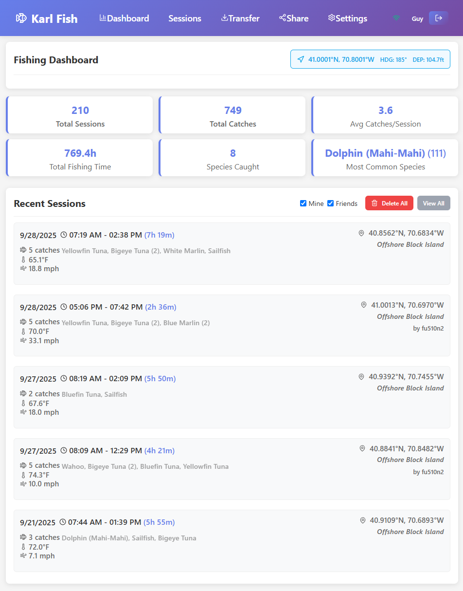

# Karl Fish - Fishing Log Application



A comprehensive React-based fishing log application that can be deployed as a web app or desktop/tablet application using Tauri. Features integration with NMEA 2000 marine electronics networks for automatic data collection from all connected devices.

## Features

### 🎣 Core Functionality
- **Fishing Session Logging**: Record date, time, location, and environmental conditions
- **Fish Catch Tracking**: Log species, length, weight, condition, bait, and notes
- **Environmental Data**: Track weather conditions, water temperature, depth, and clarity
- **Location Services**: GPS integration for accurate position logging

### 📡 NMEA 2000 Integration
- **NMEA 2000 Network Support**: Automatic data collection from all connected marine electronics via N2K gateway
- **Real-time Data**: Live updates of position, depth, water temperature, weather, and engine data
- **Supported NMEA 2000 PGNs**:
  - PGN 129025 - Position, Rapid Update (GPS coordinates)
  - PGN 130306 - Wind Data (speed, direction)
  - PGN 128267 - Water Depth
  - PGN 127250 - Vessel Heading
  - PGN 127488 - Engine Parameters
  - PGN 130310 - Environmental Parameters (temperature, pressure)
  - PGN 127258 - Engine RPM
  - PGN 127505 - Fluid Level (fuel, water, etc.)

### 💾 Data Management
- **Local Storage**: IndexedDB for offline data storage
- **Data Export**: CSV and JSON export options
- **Email Integration**: Send fishing logs via email
- **Statistics**: Comprehensive fishing statistics and reports
- **Search & Filter**: Find sessions by species, location, or notes

### 🖥️ Deployment Options
- **Web Application**: Run in any modern browser
- **Desktop App**: Native desktop application using Tauri
- **Cross-platform**: Windows, macOS, and Linux support

## Installation

### Prerequisites
- Node.js 16+ 
- Rust (for Tauri desktop builds)
- Git

### Web Application
```bash
# Clone the repository
git clone <repository-url>
cd karl-fish

# Install dependencies
npm install

# Start development server
npm run dev

# Build for production
npm run build
```

### Desktop Application (Tauri)
```bash
# Install Tauri CLI
npm install -g @tauri-apps/cli

# Run in development mode
npm run tauri:dev

# Build desktop application
npm run tauri:build
```

## NMEA 2000 Setup

### 1. Gateway Configuration
1. Install a YDWG-02 or similar NMEA 2000 Wi-Fi gateway on your N2K network
2. Connect the gateway to your vessel's NMEA 2000 backbone
3. Power on the gateway and connect to its Wi-Fi network
4. Note the gateway's IP address (typically 192.168.4.1)

### 2. Application Configuration
1. Open Karl Fish application
2. Go to Settings → NMEA 2000 Integration
3. Enter the gateway IP address (default port: 2000)
4. Test the connection to verify data flow
5. Enable auto-connect for automatic data collection

### 3. Supported Data
The application automatically collects from all connected N2K devices:
- GPS position and speed (from GPS/Chartplotters)
- Water depth and temperature (from depth sounders)
- Air temperature and pressure (from weather stations)
- Wind speed and direction (from wind sensors)
- Engine data (RPM, fuel flow, temperature from engine sensors)
- Heading and course data (from compass/autopilot)

## Usage

### Creating a Fishing Session
1. Click "New Session" from the dashboard
2. Enter basic information (date, time, location)
3. Add environmental conditions (weather, water)
4. Log fish catches with details
5. Save the session

### NMEA 2000 Data Integration
1. Ensure NMEA 2000 gateway is connected and configured
2. Start a new fishing session
3. The app will automatically populate from all connected devices:
   - GPS coordinates (from GPS/Chartplotter)
   - Water depth and temperature (from depth sounder)
   - Weather conditions (from weather station)
   - Wind data (from wind sensor)
   - Engine parameters (from engine sensors)

### Data Export
1. Go to the Export page
2. Choose format (CSV or JSON)
3. Select date range (optional)
4. Download or email the data

## Data Structure

### Fishing Session
```typescript
interface FishingSession {
  id: string;
  date: Date;
  startTime: Date;
  endTime?: Date;
  location: Location;
  weather: WeatherConditions;
  water: WaterConditions;
  catches: FishCatch[];
  notes?: string;
}
```

### Fish Catch
```typescript
interface FishCatch {
  id: string;
  species: string;
  length: number; // cm
  weight?: number; // kg
  condition: 'alive' | 'released' | 'kept' | 'dead';
  bait?: string;
  lure?: string;
  technique?: string;
  notes?: string;
}
```

## API Reference

### NMEA 2000 Service
```typescript
// Connect to NMEA 2000 gateway
await nmea2000Service.connect('192.168.4.1', 2000);

// Check connection status
const status = nmea2000Service.getConnectionStatus();

// Disconnect
nmea2000Service.disconnect();
```

### Data Service
```typescript
// Create new session
const sessionId = await FishingDataService.createSession(sessionData);

// Get all sessions
const sessions = await FishingDataService.getAllSessions();

// Search sessions
const results = await FishingDataService.searchSessions('bass');

// Get statistics
const stats = await FishingDataService.getSessionStats();
```

## Development

### Project Structure
```
src/
├── components/         # React components
├── database/           # IndexedDB data layer
├── services/           # Business logic services
├── types/              # TypeScript interfaces
├── utils/              # Utility functions
└── App.tsx             # Main application component
```

### Key Technologies
- **React 18** - UI framework
- **TypeScript** - Type safety
- **Dexie** - IndexedDB wrapper
- **Tauri** - Desktop app framework
- **@canboat/canboatjs** - NMEA 2000 PGN parsing
- **Lucide React** - Icons
- **Date-fns** - Date utilities

## Contributing

1. Fork the repository
2. Create a feature branch
3. Make your changes
4. Add tests if applicable
5. Submit a pull request

## License

This project is licensed under the MIT License - see the LICENSE file for details.

## Support

For issues and questions:
1. Check the documentation
2. Search existing issues
3. Create a new issue with detailed information

## Roadmap

- [ ] Photo integration for fish catches
- [ ] Advanced analytics and charts
- [ ] Cloud synchronization
- [ ] Mobile app version
- [ ] Additional NMEA 2000 device support
- [ ] Fishing spot recommendations
- [ ] Weather forecast integration
